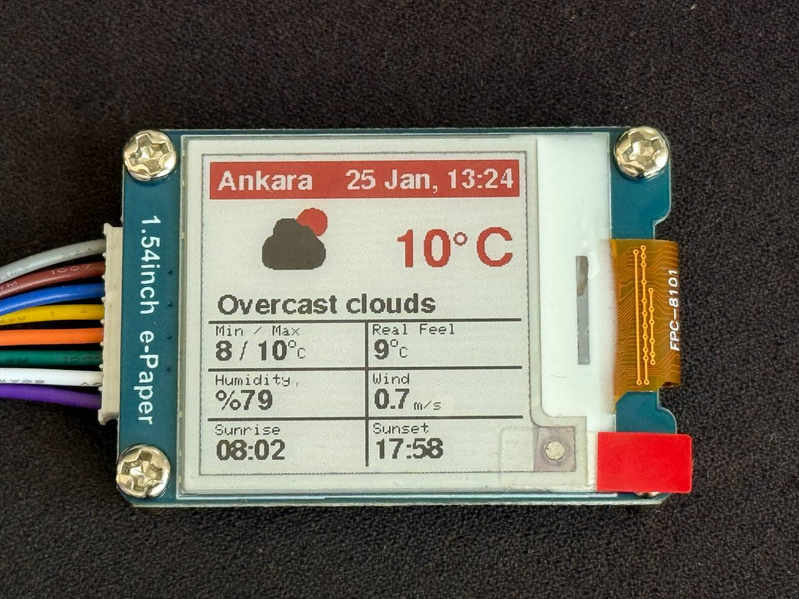
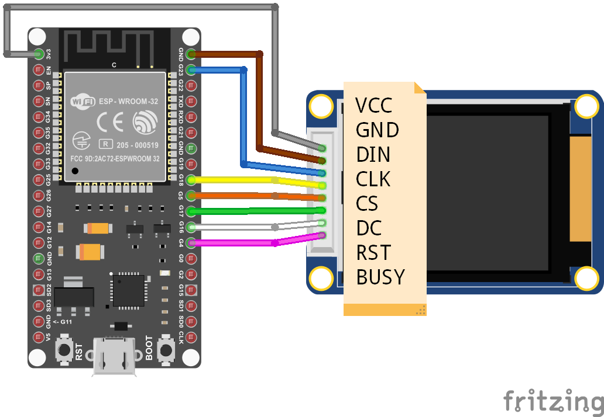

# ESP32 e-Paper Weather Station

A low-power, minimalist weather station powered by an ESP32-Wroom-32U and a Waveshare 1.54" e-Paper display. This project fetches real-time weather data from the OpenWeatherMap API and displays it on a crisp, tri-color (Red/Black/White) e-Ink screen.

<div align="center">
  
</div>

## Features

* **Tri-Color Display:** Utilizes the red, black, and white capabilities of the Waveshare e-Paper module for a distinct, high-contrast UI.
* **Deep Sleep Power Saving:** The device wakes up, updates the screen, and immediately enters deep sleep to maximize battery life.
    * **Success Cycle:** Updates every 4 hours.
    * **Error Cycle:** Retries in 10 minutes if Wi-Fi or API fails (screen content is preserved to avoid displaying error messages permanently).
* **Comprehensive Data:** Displays City, Date, Time, Temperature, Weather Condition, Min/Max Temp, Real Feel, Humidity, Wind Speed, Sunrise, and Sunset times.
* **Custom Icons:** Includes custom-designed, pixel-perfect weather icons.

## Hardware Requirements

* **Microcontroller:** ESP32 (Tested on ESP32-WROOM-32U)
* **Display:** Waveshare 1.54inch e-Paper Module (B) V2 (SSD1680 Driver)
* **Connection:** SPI Interface

## Wiring Diagram

Connect the e-Paper HAT to the ESP32 pins as defined in `config.h`:

<table>
  <tr>
    <td width="50%" valign="middle">
      
    </td>
    <td width="50%" valign="middle">
      <table border="0">
        <tr><th>e-Paper Pin</th><th>ESP32 Pin</th><th>Function</th></tr>
        <tr><td><b>VCC</b></td><td><b>3.3V</b></td><td>Power</td></tr>
        <tr><td><b>GND</b></td><td><b>GND</b></td><td>Ground</td></tr>
        <tr><td><b>DIN</b></td><td><b>GPIO 23</b></td><td>MOSI</td></tr>
        <tr><td><b>CLK</b></td><td><b>GPIO 18</b></td><td>SCK</td></tr>
        <tr><td><b>CS</b></td><td><b>GPIO 5</b></td><td>Chip Select</td></tr>
        <tr><td><b>DC</b></td><td><b>GPIO 17</b></td><td>Data/Cmd</td></tr>
        <tr><td><b>RST</b></td><td><b>GPIO 16</b></td><td>Reset</td></tr>
        <tr><td><b>BUSY</b></td><td><b>GPIO 4</b></td><td>Busy Status</td></tr>
      </table>
    </td>
  </tr>
</table>

## Dependencies

This project requires the following Arduino libraries:

* **GxEPD2** by Jean-Marc Zingg (Display Driver)
* **Adafruit GFX Library** (Graphics Core)
* **ArduinoJson** by Benoit Blanchon (JSON Parsing)
* **HTTPClient** (Built-in ESP32 lib)
* **WiFi** (Built-in ESP32 lib)

## Configuration

1.  **Clone the repository:**
    ```bash
    git clone https://github.com/barkinsarikartal/ESP32_e-Paper_Weather_Station.git
    ```
2.  **Open `config.h`** and update your credentials:
    ```cpp
    // config.h
    const char* WIFI_SSID = "YOUR_WIFI_SSID";
    const char* WIFI_PASS = "YOUR_WIFI_PASSWORD";
    
    // Get your free API key from https://openweathermap.org/
    String OPENWEATHER_URL = "https://api.openweathermap.org/data/2.5/weather?q=CITY,COUNTRY&units=metric&appid=YOUR_API_KEY"; 
    ```
3.  **Upload:** Connect your ESP32 via USB and upload the code using the Arduino IDE.

## File Structure

* `ESP32_e-Paper_Weather_Station.ino`: Main application logic, deep sleep management, and UI rendering.
* `config.h`: Configuration file for Wi-Fi credentials, API endpoints, pin definitions, and sleep timers.
* `bitmaps.h`: Contains byte arrays for the custom weather icons (Sun, Clouds, Rain, Snow, etc.).

## Power Consumption Logic

To ensure longevity, the code implements a "Silent Fail" mechanism:
* **If Data Fetched:** The screen updates, and the ESP32 sleeps for **4 hours**.
* **If Connection Fails:** The screen **is not updated** (preserving the last known good weather data), and the ESP32 sleeps for only **10 minutes** before retrying.

## License

This project is open-source and available under the MIT License.